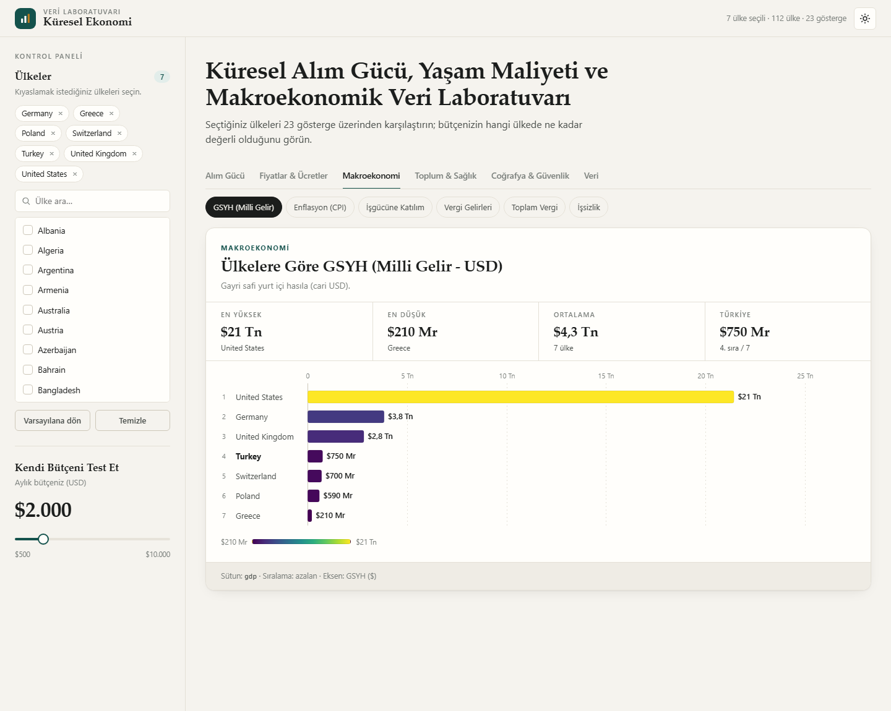
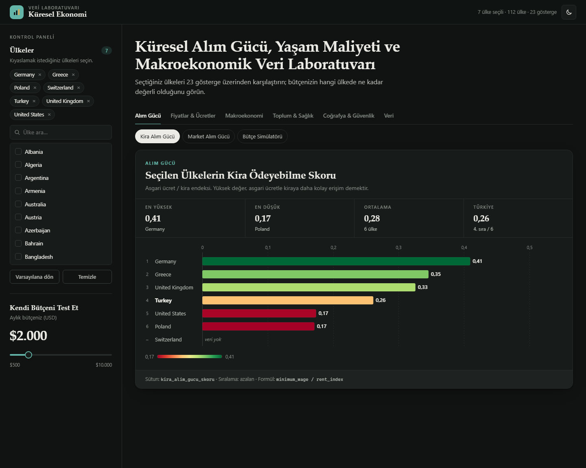
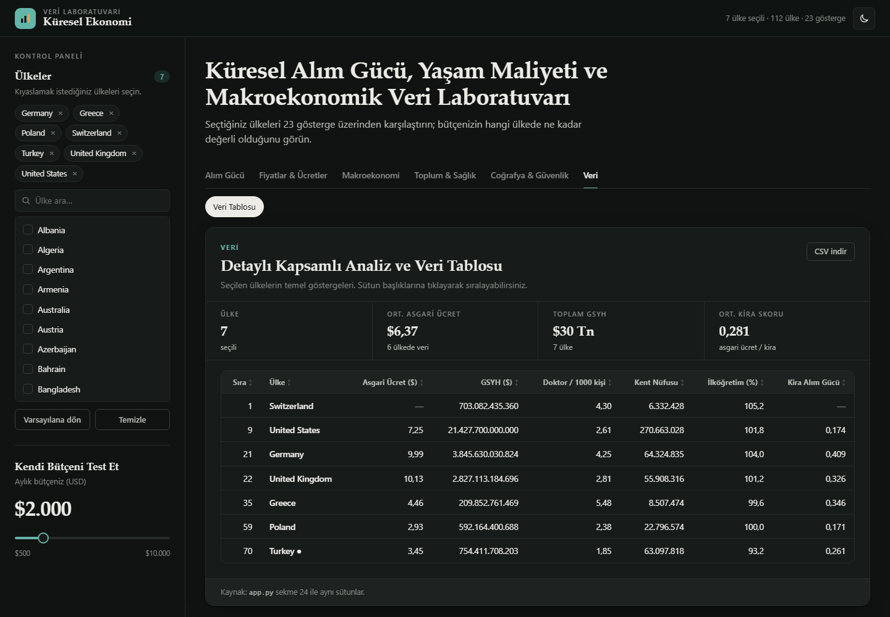

# 🌍 Küresel Ekonomi ve Yaşam Laboratuvarı

112 ülkenin **kira ve market alım gücünü**, yaşam maliyetini, asgari ücretini ve 20'den fazla makroekonomik/sosyal göstergesini karşılaştıran interaktif veri paneli. Kendi aylık bütçenizi girip hangi ülkede ne kadar "zengin" olacağınızı görebilirsiniz.

Proje iki arayüz içerir:

| Sürüm | Teknoloji | Çalıştırma |
|---|---|---|
| **Web** (önerilen) | Flask API + saf HTML / CSS / JavaScript | `python server.py` |
| Streamlit | Streamlit + Plotly | `streamlit run app.py` |

Web arayüzünde hiçbir harici kütüphane, CDN, web fontu veya framework yoktur. Grafikler kütüphane kullanılmadan, SVG ile çizilir.



<details>
<summary>Diğer ekran görüntüleri</summary>




</details>

## Özellikler

- **23 gösterge + veri tablosu**: `app.py`'deki 24 sekmenin birebir karşılığı, 6 kategoride gruplanmış.
- **Bütçe simülatörü**: 500–10.000 USD arası bütçenizi ülkelerin asgari ücretiyle kıyaslar.
- **Ülke seçici**: arama, tek tıkla ekleme/çıkarma, varsayılana dönme.
- **Özet şeridi**: her göstergede en yüksek, en düşük, ortalama ve Türkiye'nin sırası.
- **Sıralanabilir tablo** ve **CSV indirme**.
- **Açık / koyu tema**, mobil uyumlu yerleşim, klavye ile gezinme.
- Seçimler tarayıcıda saklanır, açık olan sekme URL'de tutulur (`/#gsyh` gibi), böylece bağlantıyla paylaşılabilir.

## Kurulum

```bash
git clone https://github.com/<kullanici-adi>/<repo-adi>.git
cd <repo-adi>

python -m venv .venv
# Windows
.venv\Scripts\activate
# macOS / Linux
source .venv/bin/activate

pip install -r requirements.txt
```

## Çalıştırma

```bash
python server.py
```

Tarayıcıda **http://127.0.0.1:5000** adresini açın.

| Ortam değişkeni | Varsayılan | Açıklama |
|---|---|---|
| `PORT` | `5000` | Sunucu portu |
| `FLASK_DEBUG` | `0` | `1` yapılırsa otomatik yeniden yükleme açılır |

Streamlit sürümü için: `streamlit run app.py`

## Hesaplama mantığı

`server.py`, `app.py`'deki mekaniği **değiştirmeden** uygular:

```text
kira_alim_gucu_skoru   = minimum_wage / rent_index
market_alim_gucu_skoru = minimum_wage / groceries_index
zenginlik_skoru        = aylık_bütçe / minimum_wage
```

Her gösterge `app.py`'deki ilgili sekmeyle aynı sütunu, aynı sıralama yönünü (İşsizlik artan, diğerleri azalan) ve aynı sayı formatını kullanır.

> **Not:** CSV'deki bazı sütunlar (`gdp`, `cpi_change_(%)`, `unemployment_rate` vb.) `"$703,082,435,360"`, `"4.58%"` gibi metin olarak kayıtlıdır. API bunları JSON'a çevirirken `$ , %` karakterlerini temizleyip sayıya dönüştürür. Böylece sıralamalar sayısal olarak yapılır. CSV dosyası değiştirilmez.

## API

| Uç nokta | Açıklama |
|---|---|
| `GET /api/meta` | Ülke listesi, varsayılan ülkeler, bütçe sınırları, gösterge tanımları |
| `GET /api/metric/<id>?countries=A\|B&budget=2000` | Seçilen ülkeler için sıralı `{country, value}` listesi |
| `GET /api/table?countries=A\|B` | Veri tablosu (8 sütun) |

Örnek:

```bash
curl "http://127.0.0.1:5000/api/metric/kira?countries=Turkey|Germany|Poland"
```

Gösterge kimlikleri: `kira`, `market`, `butce`, `asgari`, `yasam`, `yasam-kira`, `restoran`, `gsyh`, `enflasyon`, `isgucu`, `vergi-gelir`, `kentlesme`, `ilkogretim`, `yasam-beklentisi`, `toplam-vergi`, `doktor`, `cepten-saglik`, `bebek-olum`, `issizlik`, `benzin`, `dogum`, `askeri`, `enlem`.

## Proje yapısı

```text
.
├── app.py                     # Streamlit sürümü (orijinal, değiştirilmedi)
├── server.py                  # Flask: JSON API + statik dosya sunucusu
├── final_ekonomi_verisi.csv   # Veri seti
├── static/
│   ├── index.html
│   ├── favicon.svg
│   ├── css/style.css          # Tasarım sistemi (açık/koyu tema)
│   └── js/
│       ├── chart.js           # Bağımlılıksız SVG çubuk grafik
│       └── app.js             # Arayüz mantığı
├── docs/                      # README ekran görüntüleri
├── requirements.txt
└── README.md
```

## Veri hakkında

- `minimum_wage` sütunundaki değerler **saatlik** asgari ücrete karşılık gelir (ör. ABD 7,25 $). `app.py`'deki başlıklar korunmuştur.
- Bazı ülkelerde bazı göstergeler için veri yoktur. Bu ülkeler grafikte "veri yok" olarak, listenin sonunda gösterilir.
